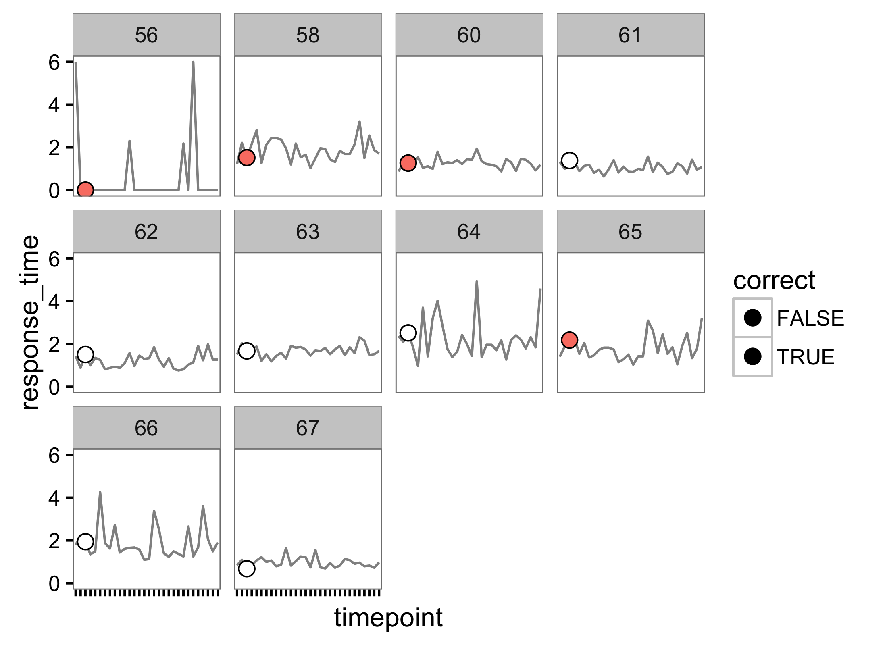

# Title

<!-- These two chunks should be added in the beginning of every .Rmd that you want to source an .R script -->
<!--  The 1st mandatory chunck  -->
<!--  Set the working directory to the repository's base directory -->


<!--  The 2nd mandatory chunck  -->
<!-- Set the report-wide options, and point to the external code file. -->


<!-- Load 'sourced' R files.  Suppress the output when loading packages. --> 

```
Warning: package 'ggplot2' was built under R version 3.2.4
```


<!-- Load the sources.  Suppress the output when loading sources. --> 


<!-- Load any Global functions and variables declared in the R file.  Suppress the output. --> 


<!-- Declare any global functions specific to a Rmd output.  Suppress the output. --> 


<!-- Load the datasets.   -->

```
[1] "nirs" "dx"  
```

```
$nirs
[1] "source"  "channel"

$dx
[1] "gng"   "stern"
```

<!-- Inspect the datasets.   -->


<!-- Tweak the datasets.   -->

```
Observations: 300
Variables: 16
$ person_id      <int> 56, 56, 56, 56, 56, 56, 56, 56, 56, 56, 56, 56, 56, 56, 56, 56, 56, 56, 56, 56, 56, 56, 56, ...
$ timepoint      <chr> "1", "2", "3", "4", "5", "6", "7", "8", "9", "10", "11", "12", "13", "14", "15", "16", "17",...
$ rest_initial   <int> 30, 30, 30, 30, 30, 30, 30, 30, 30, 30, 30, 30, 30, 30, 30, 30, 30, 30, 30, 30, 30, 30, 30, ...
$ encoding       <dbl> 2, 2, 2, 2, 2, 2, 2, 2, 2, 2, 2, 2, 2, 2, 2, 2, 2, 2, 2, 2, 2, 2, 2, 2, 2, 2, 2, 2, 2, 2, 2,...
$ maint          <dbl> 6, 6, 6, 6, 6, 6, 6, 6, 6, 6, 6, 6, 6, 6, 6, 6, 6, 6, 6, 6, 6, 6, 6, 6, 6, 6, 6, 6, 6, 6, 6,...
$ retrieval      <dbl> 6, 6, 6, 6, 6, 6, 6, 6, 6, 6, 6, 6, 6, 6, 6, 6, 6, 6, 6, 6, 6, 6, 6, 6, 6, 6, 6, 6, 6, 6, 6,...
$ rest           <int> 4, 4, 4, 4, 4, 4, 4, 4, 4, 4, 4, 4, 4, 4, 4, 4, 4, 4, 4, 4, 4, 4, 4, 4, 4, 4, 4, 4, 4, 30, 4...
$ rest_final     <int> 30, 30, 30, 30, 30, 30, 30, 30, 30, 30, 30, 30, 30, 30, 30, 30, 30, 30, 30, 30, 30, 30, 30, ...
$ strings        <chr> "PCVMYRNS", "HFZQXRG", "HKMDXQJY", "DWYSQPK", "NSHGXYJ", "GDXBMJZL", "FRCSNQP", "HSYLNWXV", ...
$ targets        <chr> "R", "W", "Q", "L", "V", "B", "H", "L", "T", "C", "X", "C", "D", "G", "T", "Q", "J", "C", "N...
$ response       <int> 0, 1, 1, 0, -2, -2, -2, -2, -2, -2, -2, -2, -2, -2, -2, -2, -2, -2, -2, -2, -2, -2, -2, -2, ...
$ response_time  <dbl> 5.993818, 2.296271, 2.177960, 5.993956, 0.000000, 0.000000, 0.000000, 0.000000, 0.000000, 0....
$ correct        <lgl> FALSE, FALSE, TRUE, TRUE, FALSE, FALSE, FALSE, FALSE, FALSE, FALSE, FALSE, FALSE, FALSE, FAL...
$ compatible     <int> 1, 0, 1, 0, 0, 1, 0, 1, 0, 0, 0, 1, 1, 1, 1, 1, 1, 1, 1, 0, 0, 1, 0, 0, 0, 0, 0, 0, 1, 1, 1,...
$ target_x       <lgl> FALSE, FALSE, FALSE, FALSE, FALSE, FALSE, FALSE, FALSE, FALSE, FALSE, TRUE, FALSE, FALSE, FA...
$ target_x_value <chr> " ", " ", " ", " ", " ", " ", " ", " ", " ", " ", "X", " ", " ", " ", " ", " ", " ", " ", " ...
```

```
# A tibble: 300 × 16
   person_id timepoint rest_initial encoding maint retrieval  rest rest_final  strings targets response response_time
       <int>     <chr>        <int>    <dbl> <dbl>     <dbl> <int>      <int>    <chr>   <chr>    <int>         <dbl>
1         56         1           30        2     6         6     4         30 PCVMYRNS       R        0      5.993818
2         56         2           30        2     6         6     4         30  HFZQXRG       W        1      2.296271
3         56         3           30        2     6         6     4         30 HKMDXQJY       Q        1      2.177960
4         56         4           30        2     6         6     4         30  DWYSQPK       L        0      5.993956
5         56         5           30        2     6         6     4         30  NSHGXYJ       V       -2      0.000000
6         56         6           30        2     6         6     4         30 GDXBMJZL       B       -2      0.000000
7         56         7           30        2     6         6     4         30  FRCSNQP       H       -2      0.000000
8         56         8           30        2     6         6     4         30 HSYLNWXV       L       -2      0.000000
9         56         9           30        2     6         6     4         30 MJYZPDVS       T       -2      0.000000
10        56        10           30        2     6         6     4         30 FXVKPYGJ       C       -2      0.000000
# ... with 290 more rows, and 4 more variables: correct <lgl>, compatible <int>, target_x <lgl>, target_x_value <chr>
```


<!-- Basic table view.   -->

```r
# 
# names(ds)
# ds %>% showfreq("person_id")
# ds %>% showfreq("source")
# ds %>% showfreq("condition")
# ds %>% showfreq("sex")
# ds %>% showfreq("farm_id")
# 
# summary(ds$age)
```

<!-- Basic graph view.   -->

```r
# individual timeserise with X
g <- ds %>% 
  # dplyr::filter(person_id %in% 101:105) %>%
  ggplot(aes(x=timepoint,y=response_time)) +
  geom_line(aes(group=person_id),size=.5, alpha=.5) +
  # geom_point(aes(fill=correct),shape=21, color="black", alpha=1, size=2)+
  geom_point(aes(shape = target_x_value, fill=correct), size=3)+
  scale_shape_manual(values = c("X"=21," "=32)) + 
  # geom_text(aes(label = target_x_value ), size=4, nudge_y = +.5)+
  # geom_text(aes(label = target_x_value ,y=Inf), size=4)+
  scale_fill_manual(values = c("TRUE"="white","FALSE"="salmon"))+
  # scale_color_manual(values = c("TRUE"="white","FALSE"="salmon"))+
  facet_wrap("person_id",scales = "fixed", as.table = T)+
  # theme_tufte()+
  theme_bw() +
  # theme_minimal() +
  theme(
    panel.grid.major = element_blank(),
    panel.grid.minor = element_blank(),
    axis.text.x = element_blank()
  )+
  guides(shape=F)

# theme_void()
g
```



```r
####
```


